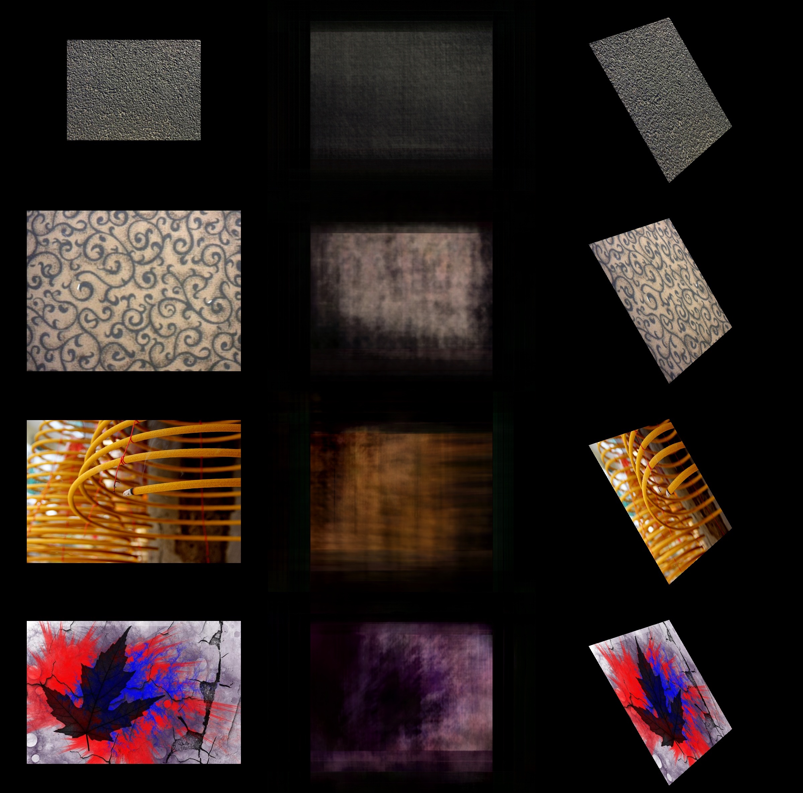
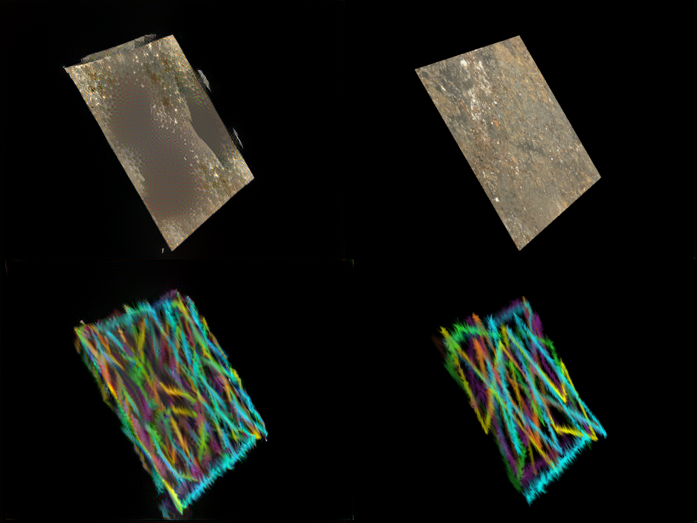
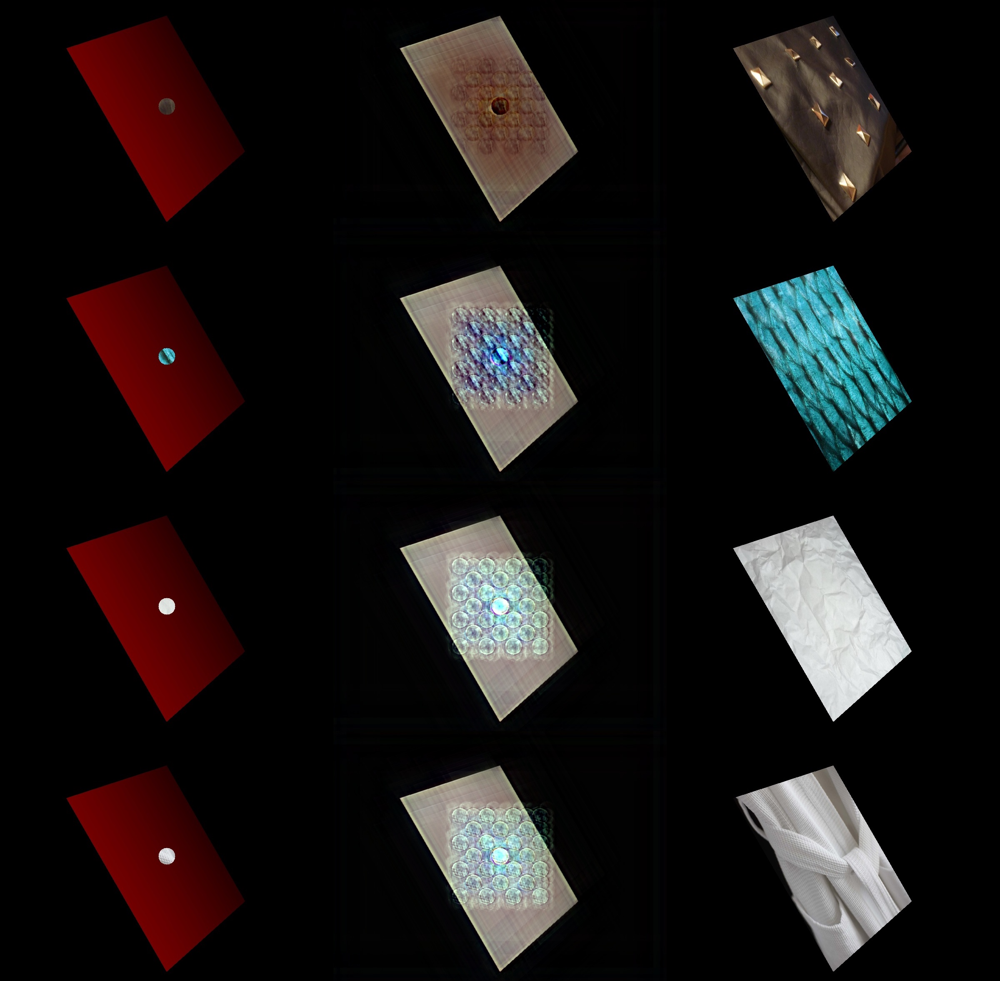

# Applying Textures to Untextured Images Using Neural Networks
[See Proposal here](https://philkuz.github.io/184final/proposal)  
[Milestone Slides](https://philkuz.github.io/184final/MilestoneSlides.pdf)  
[Milestone Video](https://www.youtube.com/watch?v=iO4kSVsWVwg&feature=youtu.be)

## Summary

Producing textures for images is a labor intensive process that can take significant human time. Additionally, older source material, such as video games from antiquated hardware, lacks textural detail of the level modern systems contain. Finding a fast and effective way to automatically apply textures to untextured images could significantly reduce labor for projects that require handmade textures and additionaly efficiently reviatlaize older source material. We attempt to apply textures automatically to non-textured images of 3d renderings using a fully-convolutional neural network as a final step in a graphics pipeline. Our end goal is to produce a system in which one produces an untextured rendering, passes it into a trained Convolutional Neural Network that then outputs a (hopefully) properly textured result. Of particular interest is the succesfull application of textures to polygons rotated in 3d space as texture application on individual polygons is a first step to applying textures to polygon meshes. Thus far we have produced partial results in which some level of the desired texture is evident on our models output. We summarize the progress we have made in this direction and detail our next steps.

## Experimental Results so far:

### Texture Cue 
Ultimately, we desired to pass in an image with a texture cue (ie painted by a user) that provides some information on what the texture should be inside of certain regions of the image. In the image below, you can see the net is able to learn the proper color of the output object - but it does not manage to copy the texture details of the cue. We suspect that this is the result of the L2 loss and explore other options in the next steps.

### L0 Smoothing
As stated in the proposal, one of our dataset involved texturizing "texture-less" real images. We created such training pairs by using the L0 norm to wipe the high frequency textures from the image. In the result below, the left column shows the input, "texture-less" images, the middle represents the output of the network, and the right
is the ground-truth, textured images.

Clearly the results are promising, but it makes sense that many textures are not preserved. Additionally, it appears that the network likes to hallucinate weird lines in the image as you can see in the sky pictures. While results from these experiments are intriguing, this specific application may be wodingering out of the scope of our project. We including the result here, but we will likely not continue down this route for future experiemnts.
### Rotated Plane
Finally, we ran a test where we attempted to learn a geometric transformation, a proof of concept for another texture input method where we'd provide the texture directly, 
rather than through a texture cue. This method failed dramatically, as we had no extra parameters or degrees of freedom to ensure that a transform was learned. Upon reviewing the results, we realized that prevailing techniques that involve geometric transformations for neural nets either learn parameters in a predefined model or have the transform parameters explicitly defined. In order to texture a mesh, the network would need to imply a homographic transform from the input's geometry and apply this to the input texture, we believe this approach will not be fruitful, and will primarily focus on the texture cue direction.

## Successes and Next Steps
So far we've had difficulty getting these techniques to work. However a baseline test with style transfer, with the target texture suggests that we should be able to 
make some strides using a style loss as a part of our metric. 

We started training the network with  a style loss (using a separate VGG network, inline with [Johnson et al.](https://arxiv.org/abs/1603.08155) and here are some preliminary results.

The results are slightly hard to decode and its questionable whether this will help much. We're playing around with the weighting of the style loss with respect to the original objective. In the above images, the loss had not converged at the time the output was made, however, the style transfer result suggests incorporation of style loss holds potential.
### Generative Adversarial Networks
We are currently having issues with getting the network to realiably produce textures over our entire target. We suspect that a part of the problem is our current MSE objective. We believe that learning an adversarial loss in line with [Pix2Pix](https://phillipi.github.io/pix2pix/) may yield positive results. This is more of a stretch goal at the moment, but we're confident we'll be
able to take a stab at the problem using this model.

### Multiple orientations and scales
In all of our images you likely noticed that we're currenlty only testing a single sized plane in a single orientation. We are currently creating a dataset of multiple orientations and scales that we will train on after we get some success in better recreating the textures.

### Providing variable cues
For now, we've only provided texture cues in the center of the images. However, the dream would be to be able to provide cues in different parts of the image. If we have enough time, this will be a part of our final project as well.

### References:
[1] Chen, Qifeng, Jia Xu, and Vladlen Koltun. "Fast image processing with fully-convolutional networks." *IEEE International Conference on Computer Vision*. Vol. 9. 2017. [Link](http://openaccess.thecvf.com/content_iccv_2017/html/Chen_Fast_Image_Processing_ICCV_2017_paper.html)

[2] Fast Image Processing Code [Link](https://github.com/CQFIO/FastImageProcessing)

[3] MIT-Adobe FiveK Dataset [Link](https://data.csail.mit.edu/graphics/fivek/)

[4] Xu, Li, et al. "Image smoothing via L 0 gradient minimization." ACM Transactions on Graphics (TOG). Vol. 30. No. 6. ACM, 2011. [Link](https://dl.acm.org/citation.cfm?id=2024208)

[5] Nguyen, Rang MH, and Michael S. Brown. "Fast and effective L0 gradient minimization by region fusion." Proceedings of the IEEE International Conference on Computer Vision. 2015. [Link](https://www.cv-foundation.org/openaccess/content_iccv_2015/papers/Nguyen_Fast_and_Effective_ICCV_2015_paper.pdf)

[6] Johnson, Justin, Alexandre Alahi, and Li Fei-Fei. "Perceptual losses for real-time style transfer and super-resolution." European Conference on Computer Vision. Springer, Cham, 2016.

[7] Isola, P., Zhu, J. Y., Zhou, T., & Efros, A. A. (2017). Image-to-image translation with conditional adversarial networks. arXiv preprint.
